# source-control-with-git


# 01. What is Version Control?
Version Control is a method of storing changes to files and keeping them in sync. It is used to keep track of the changes made over time to source code, documentation and configuration files. 
Provides below advantages for our test automation project:
- Collaboration
- Pipeline for CI/CD
- Early Testing
- Learning

# 02. What is Git?
- Git is a version control system which arose out of the development community and in particular Linus Torvalds.
- Git is a free and open source distributed version control system designed to handle everything from small to very large projects with speed and efficiency.
- Some other version control systems like SVN, Mercurial, etc. are also known as version control systems.
- But git is the most popular and it is very efficient, version controls the Linux kernel and the huge popularity of github.com

- Whenever we commit changes to our project, git will take a snapshot of our project.
- Git creates and stores three objects:
    1. Snapshot (Tree Object)
    2. File(s) (Blob Object)
    3. Commit (Commit Object)

- **Snapshot Object:** Git takes a snapshot of the current state of your project files. This snapshot reflects the content of the files as they are at the time of the commit.
  
- **Commit Object:** This object is created to store metadata about the commit, such as the commit message, author information, and a pointer to the snapshot (or tree object) of the project’s state.
  
- **File Objects:** These objects represent the contents of the individual files being committed. If a file has not changed since the last commit, Git will not create a new object for it, making Git very efficient with storage.

- Every time you create a commit, Git generates a unique SHA-1 hash for that commit object. This hash is calculated based on the contents of the commit (including the tree object, parent commit hashes, author information, commit message, and timestamp). This ensures that even a small change will result in a different hash, uniquely identifying each commit.

- **SHA-1 Hash in Git**: Git uses SHA-1 (Secure Hash Algorithm 1) hashes to uniquely identify each object (such as commits, trees, blobs, and tags) stored in its database. The SHA-1 hash is a 40-character string that acts as a fingerprint for the object, ensuring that each object can be uniquely referenced. This is crucial for tracking changes, managing versions, and ensuring data integrity.
 
## Three States in Distributed Version Control System
In a distributed version control system (DVCS) like Git, there are three primary states or areas where files can exist. Understanding these states helps in managing and tracking changes effectively. Here’s a brief overview of each state:


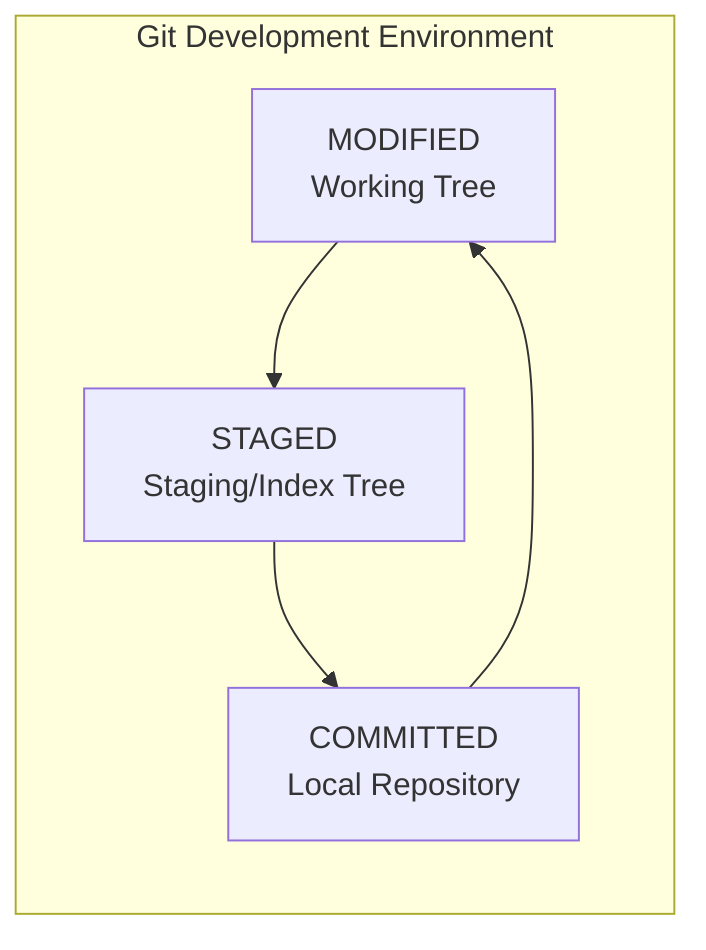

1. **Working Directory**: This is the local directory on your machine where you work on files. It includes the current version of your files as you see them in your project folder. Changes you make in this directory are not yet tracked by the version control system.

2. **Staging Area (Index)**: This area is where you prepare changes before committing them. When you stage files, you’re telling the DVCS which changes you want to include in your next commit. The staging area acts as a buffer between the working directory and the repository, allowing you to review and select changes before finalizing them.

3. **Repository**: The repository is where all committed versions of your project are stored. It includes the history of commits, branches, tags, and other metadata. Once changes are committed, they are stored in the repository and can be accessed, reviewed, or reverted as needed.

### Interaction of States

- Changes are made in the **Working Directory**.
- Selected changes are staged in the **Staging Area**.
- Staged changes are committed to the **Repository**.

# 03. Basic Git Concepts
## 3.1. Initializing and Adding
### 3.1.0. Heads up on Git Commands
```bash
# To get full list of commands
git --help

# To get detailed description about particular caommand
git help <command>
```
> For a full list of all commands, use the following go to https://git-scm.com/docs

```bash
# Set the default text editor to Vim for all users on the system
git config --system core.editor "vim"

# Set the user name for commits (global level, affects all repositories for this user)
git config --global user.name "Your Name"

# Set the user email for commits (global level, affects all repositories for this user)
git config --global user.email "youremail@example.com"

# Set the remote URL for the current repository (local level)
git config --local remote.origin.url "https://github.com/username/repo.git"

# Set the default text editor to Visual Studio Code (with wait flag) for the current user
git config --global core.editor "code --wait"

# Set Vimdiff as the default merge tool
git config --global merge.tool vimdiff

# Set Meld as the default diff tool
git config --global diff.tool meld

# Create a Git alias for the checkout command
git config --global alias.co checkout

# Create a Git alias for the branch command
git config --global alias.br branch

# Enable colored output in Git commands for the current user
git config --global color.ui true

# Set the default push behavior to 'simple' (pushing the current branch to a remote branch with the same name)
git config --global push.default simple

# Enable credential caching to store credentials temporarily
git config --global credential.helper cache

# Set line-ending conversion for cross-platform development (true for Windows)
git config --global core.autocrlf true

# Set line-ending conversion for cross-platform development (input for macOS/Linux)
git config --global core.autocrlf input
```

```bash
# shows all the differences between: working directory <-> staging/index area <-> local repo <-> remote repo
git status
```

```bash
# Show a simple list of commits with their commit hash, author, date, and message
git log

# Show a one-line summary for each commit, displaying only the commit hash and commit message
git log --oneline

# Show the commit history with a graphical representation of branches and merges
git log --graph

# Show the commit history including changes to files (diff output)
git log -p

# Show the commit history of a specific file
git log -- filename

# Show commits made by a specific author
git log --author="Author Name"

# Show commits with a specific search keyword in the commit message
git log --grep="keyword"

# Show the last n commits (e.g., last 5 commits)
git log -n 5

# Show commits from a specific date range
git log --since="2023-01-01" --until="2023-12-31"

# Show commits that introduce changes to a specific line or block of code
git log -L :function_name:filename

# Show commits along with the list of files that were changed in each commit
git log --name-only

# Show commits with detailed statistics on changes (number of lines added/removed)
git log --stat

# Show commits in reverse order (oldest first)
git log --reverse

# Show commits with abbreviated commit hash, author, date, and message in a concise format
git log --pretty=format:"%h - %an, %ar : %s"
```

### 3.1.1. Initializing Git
```bash
# initialize the repository in the current directory
git init

# Configure the user name and email for commits (locally by default)
git config user.name "Harry Potter"
git config user.email "harrypotter@hp.com"

# View the local configuration
git config -l --local

# Convert CRLF to LF on commit, leave line endings unchanged on checkout
git config --global core.autocrlf input

# Warn when a CRLF line ending is detected to prevent inconsistent line endings
git config --global core.safecrlf warn

# Set Visual Studio Code as the default Git editor, making Git wait until the editor is closed
git config core.editor "code --wait"
```

> ```git init``` command creates a new empty Git repository in the current directory. It creates a .git hidden directory in the current directory and initializes it with a .gitignore file.

> ```git config``` command will impact the file `.git/config` in the current directory.

### 3.1.2. Adding Files to Git

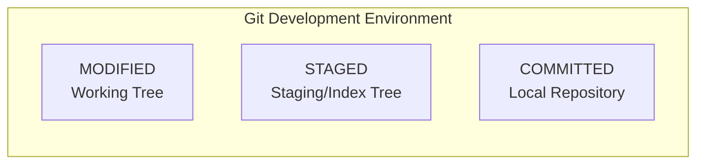

```bash
# Show the status of the staging area
git status
```
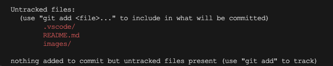

We could see nothing added to git and no files in the staging area. And also we dont want to add .vscode folder in the staging area. We could see files are Untracked and in Red color.

```bash
# Creating .gitingore file and ignoring the .vscode folder in the staging area
echo ".vscode" >> .gitignore
```

```bash
# Checking status after adding .vscode to .gitignore file
git status
```
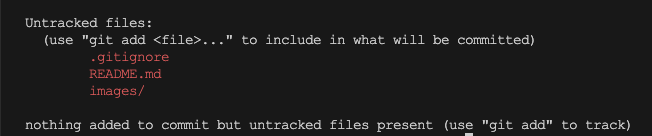
> After adding .vscode to .gitignore file, we can see that .vscode is ignored in the staging area.

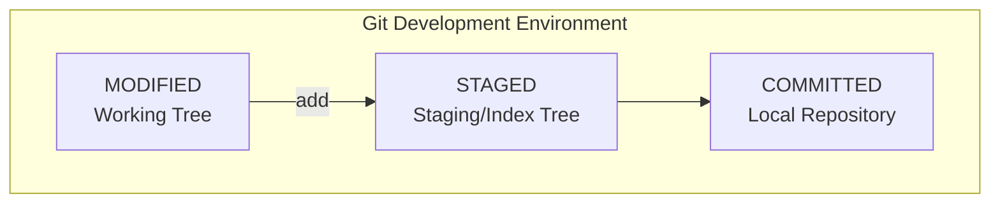

```bash
# Adding all the files to git
git add .

# Checking status after adding all the files
git status
```
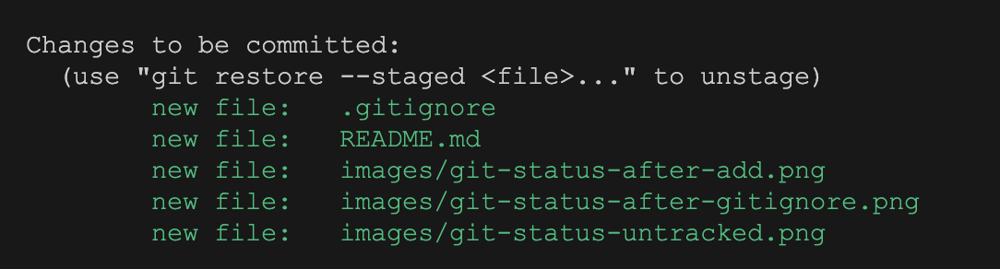
> After adding all the files to git, we can see that all the files are in Green color and staged in the staging area and ready for commit.
> Changes will happen in .git/index file after every git add.

```bash
# To view staged files
git ls-files -s
#or
git ls-files --stage
```
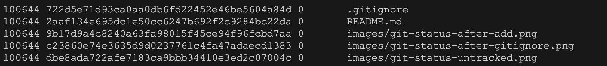

## 3.2. Committing and Pushing
### 3.2.1. Committing
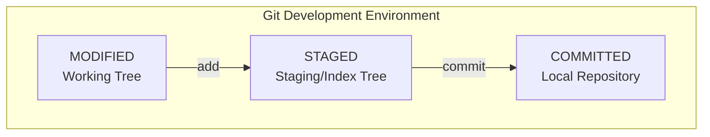

```bash
# Committing the changes with message
git commit -m "commit message"

# Committing the changes without message (it will open default text editor)
git commit # type the commit message in the editor then close the editor
```

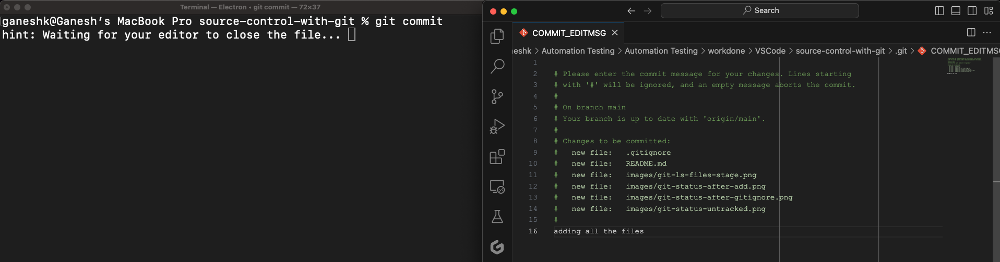

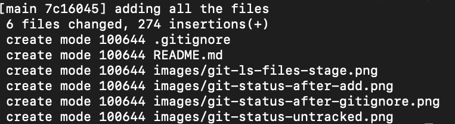

```bash
# Checking status after committing all the files
git status
```
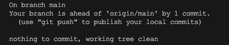


```bash
# Log the commit history after commit
git log
```
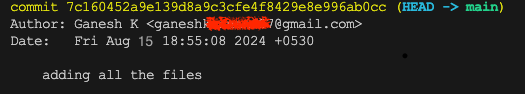

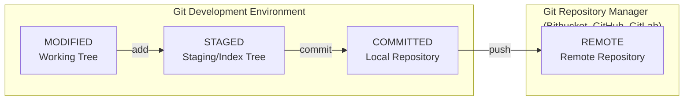

```bash
# Specifying the remote repository
git remote add origin https://github.com/username/repo.git

# Pushing the changes to remote repository
git push --set-upstream origin main # might ask for username and password if not configured
```
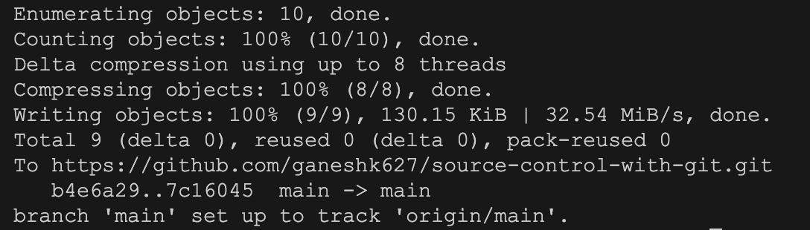

```bash
# Checking status after push
git status
```
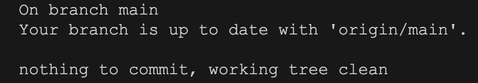

## 3.3. Cloning, Fetching, Merging and Pulling
### 3.3.1. Cloning
`git clone` creates a copy of an existing remote repository, including all its files, branches, and commit history, into your local machine.
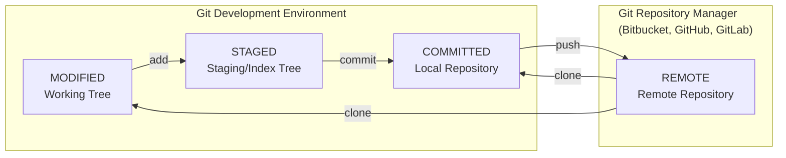
```bash
# Cloning the repository
git clone https://github.com/username/repo.git
```
### 3.3.2. Fetching
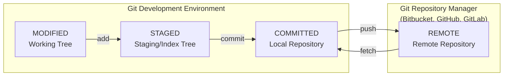
1. **Download Updates:** `git fetch` retrieves new commits, branches, and tags from the remote repository. These updates are stored in your local repository’s remote-tracking branches (e.g., `origin/main`), allowing you to see what has changed on the remote side.

2. **No Merge or Checkout:** Unlike `git pull`, `git fetch` does not merge the fetched changes into your current branch or update your working directory. It only updates the remote-tracking branches.

3. **Safe Operation:** Since `git fetch` doesn’t modify your working directory, it’s a safe operation to run frequently. It allows you to check for changes without interfering with your current work.

4. **Stay Informed:** Using `git fetch` regularly helps you stay informed about the state of the remote repository, making it easier to decide when to merge or rebase your changes.
```bash
# Fetching the changes from remote repository
git fetch
```
> After running git fetch, you can inspect the changes using commands like git log or git diff to see what commits are new. To integrate these changes into your current branch, you would typically use commands like git merge or git pull.
### 3.3.3. Merging
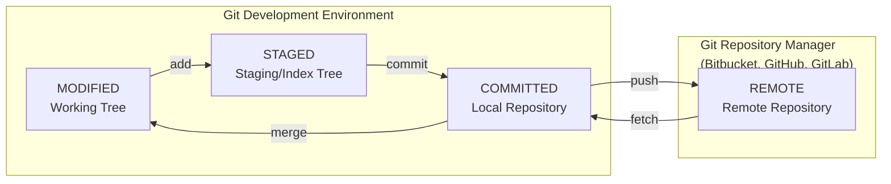


## Ways to find out the brach name
git log
git status
git branch -vv
git branch
git branch -a
